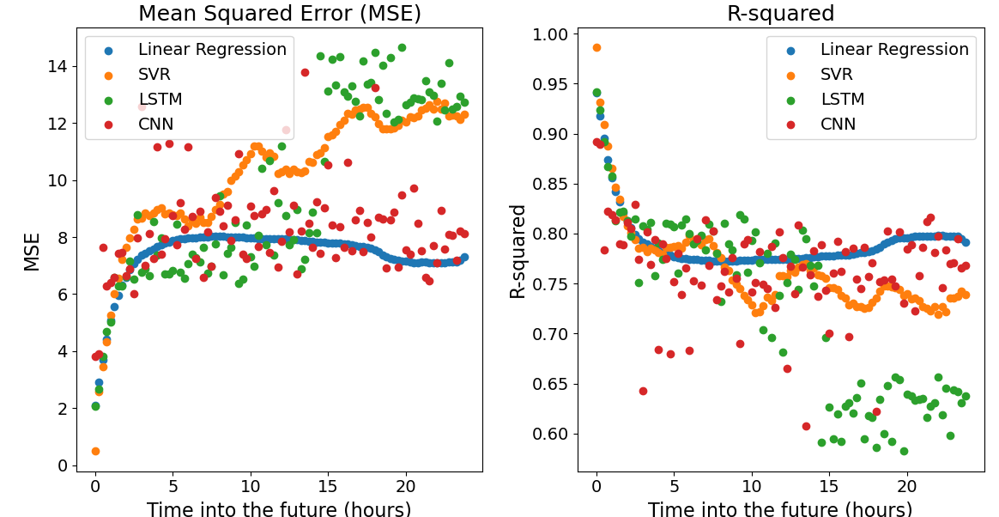
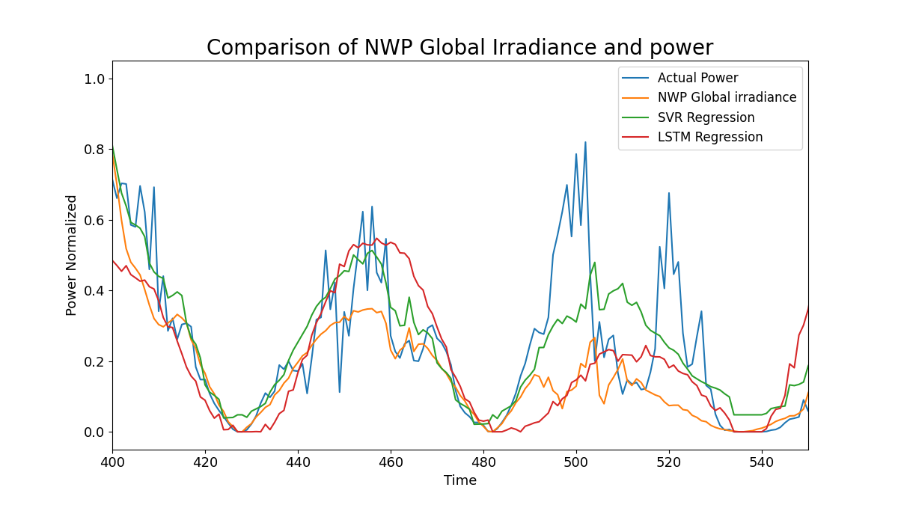

# PV Power Prediction

#### Objectives
- Become familiar with machine learning principles
- Be able to analyse and handle large amounts of data

#### Project description
The goal of this project is to predict photovoltaic (PV) power using past (Local Measured Data) and future (Numerical Weather Predictions) data. The methods used are:
- Linear Regression
- Support Vector Regression
- Long Short Term Memory Neural Network
- 1D Convolutional Neural Network

**Used tools:** Python, MATLAB, TensorFlow

#### Result
The Minimum Squared Error (MSE) and the coefficient of determination $R^2$ metrics are used to compare the models. 

One of the NWP features - the global irradiance is highly correlated with power. This figure explains parts of the reason for not achieving highly accurate predictions, as the predictions seem to mimic the NWP feature.

In the next figure this assumption is further confirmed, by analyzing the difference between power and global irradiance, SVR, LSTM, and CNN predictions.

